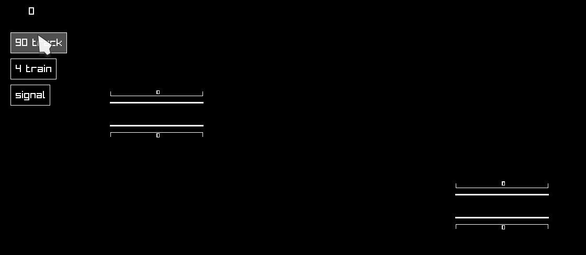

h-train
===

h-train is a simple train game, inspired by [Rail Route](https://store.steampowered.com/app/1124180/Rail_Route/), where you build tracks and dispatch trains between stations.

Building
--------

The project was written using GHC 9.2.5 with cabal.

It uses the h-raylib library which might require additional libraries. In case of problems see [h-raylib repo](https://github.com/Anut-py/h-raylib?tab=readme-ov-file#platform-specific-requirements) for more.

You can build the project with
```
cabal build
```
and run it with
```
cabal run
```
